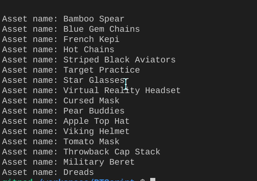

Require the shop wrapper.

```js
const shop = require("polytoria/shop");
```

Now lets fetch the items.

```js
const AllItems = shop.fetchCatalog(1); // First page.
```

We use promises to handle data.

```js
Allitems.then((data) => {
  console.log(data);
});
```

This will return an array like this:

```json
[
  {
    "AssetID": 8124,
    "AssetName": "Bamboo Spear",
    "AssetType": "hat",
    "Price": 120,
    "Currency": "Studs",
    "Limited": false,
    "CreatorID": 0,
    "Version": 1,
    "CreatorURL": "/user/1",
    "CreatorName": "Polytoria",
    "BestPrice": 0
  },
  {
    "AssetID": 8118,
    "AssetName": "Blue Gem Chains",
    "AssetType": "hat",
    "Price": 35,
    "Currency": "Studs",
    "Limited": true,
    "CreatorID": 1,
    "Version": 1,
    "CreatorURL": "/user/1",
    "CreatorName": "Polytoria",
    "BestPrice": 150
  }
]
```

But much more bigger. Just handle the data like this:

```js
Allitems.then((data) => {
  data.foreach();
  console.log(data.name);
  array.forEach((asset) => {
    console.log("Asset name:" + asset.name);
  });
});
```
This code will log all the item names like this:
